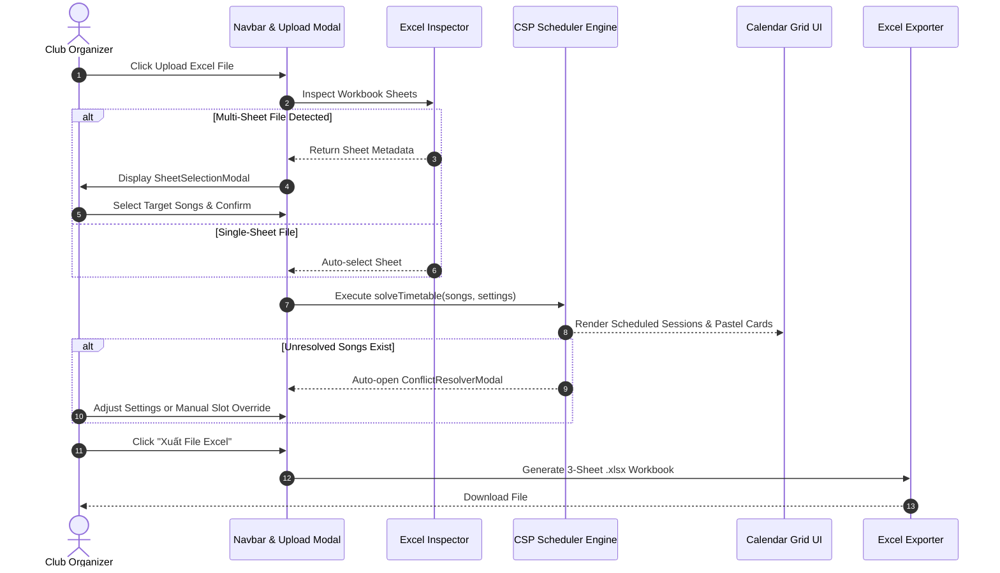

# Business & Product Specification

**Project**: CSAC Timetable Studio 🎵📅  
**Document Status**: Active / Single Source of Truth (SSOT)  
**Last Updated**: September 2026

---

## 1. Product Vision & Value Proposition

### 1.1 Executive Summary
**CSAC Timetable Studio** is an automated scheduling system created for university music clubs, bands, and cultural performance groups (specifically CSAC — Club of Songs And Culture). 

The application transforms raw member availability votes submitted via Excel workbooks into an optimized, conflict-free weekly practice schedule in seconds.

### 1.2 Core Business Pain Points Addressed

| Pain Point | Operational Impact | CSAC Timetable Studio Solution |
| :--- | :--- | :--- |
| **Member Overlap Conflict** | Performers belong to multiple songs simultaneously; manual scheduling causes double-booking. | Hard constraint enforcement guaranteeing **0 member double-bookings** across practice rooms. |
| **Suboptimal Attendance** | Rehearsals scheduled with missing key band members lower practice efficiency. | Multi-pass CSP algorithm prioritizing **100% full attendance** slots. |
| **Excel Ingestion Friction** | Multi-sheet files (1 tab per song) require manual copying & pasting. | Automated multi-tab inspection with interactive **Sheet Selection Modal**. |
| **Manual Frequency Tuning** | Different songs need 1, 2, or 3+ sessions based on performance difficulty. | Per-song configurable target frequency with automatic capacity bottleneck warnings. |
| **Reporting Complexity** | Generating individual schedules for 50+ members takes hours. | 1-click **3-Sheet Excel Exporter** generating master grid, song breakdown, and individual member timetables. |

---

## 2. Target User Personas & Use Cases

### 2.1 User Personas

1. **Club President / Manager (Organizer)**
   * *Goals*: Wants to upload vote files for the upcoming week, set room limits (e.g., 1 or 2 rooms), solve schedule, and export the official Excel timetable for club announcement.
   * *Key Needs*: Speed, zero double-booking errors, clean exportable reports.

2. **Band Leader / Song Lead**
   * *Goals*: Inspect candidate rehearsal slots for their specific song, set rehearsal frequency target (e.g., practice 2x this week), and review member availability notes (e.g., "bận thi thứ 4").
   * *Key Needs*: Transparency into candidate slots, ability to add notes or manually adjust slots.

3. **Club Member (Performer)**
   * *Goals*: Easily check their personalized rehearsal schedule for the week.
   * *Key Needs*: Clear filterable timetable view (e.g., select my name in UI to see my slots) and individual member schedule tab in exported Excel.

---

## 3. Functional Requirements & Business Rules

### 3.1 Data Ingestion & File Standards
* **BR-01 (Supported Formats)**: Must accept standard `.xlsx` workbooks generated from Excel, Google Sheets, or LibreOffice.
* **BR-02 (Multi-Sheet Recognition)**: When a uploaded file contains 2+ sheets, the application **must** open the `SheetSelectionModal` allowing the user to select which song tabs to import. Single-sheet files should import automatically.
* **BR-03 (Tolerant Checkbox Evaluation)**: Must recognize various availability representations: `TRUE`/`FALSE`, `1`/`0`, `"x"`, `"v"`, `"ok"`, `"có"`, `"17h-18h"`, and string checkmarks.

### 3.2 Timetable Constraint Governance
* **BR-04 (Zero Double-Booking Guarantee)**: A member **shall never** be scheduled for two different songs in the same day/time slot.
* **BR-05 (Room Allocation Limit)**: Total concurrent rehearsal sessions in any slot **shall not** exceed `maxRooms` (default: 1 room).
* **BR-06 (Attendance Priority)**:
  * *Strict Mode*: Require 100% member presence for every session.
  * *Relaxed Mode*: If `allowPartialAttendance` is enabled, permit sessions with at most 1 missing member only when 100% presence is impossible.
* **BR-07 (Session Spreading)**: Multiple sessions of the same song **should** be scheduled on distinct days of the week when possible (`spreadDays = true`).

### 3.3 Reporting & Export Rules
* **BR-08 (Excel Master Report)**: Exported `.xlsx` file **must** contain 3 sheets:
  1. `LỊCH TẬP TUẦN`: Graphical timetable grid matching pastel color themes.
  2. `CHI TIẾT BÀI HÁT`: Tabular summary sorted by song name, day, time, room, and member lists.
  3. `LỊCH CÁ NHÂN`: Comprehensive personal timetable matrix for every performer.

---

## 4. User Journey & Workflow Specifications

---

## 5. Multi-Client & Microservices Evolution

### 5.1 Platform Strategy
* **Web Client (`clients/web`)**: Primary rich web application running on SvelteKit SSR with progressive enhancement, designed in tactile Neumorphic (Soft UI) physical materiality (`#e0e5ec`).
* **Mobile Clients (`clients/ios`, `clients/android`, `clients/mobile-cross`)**: Future native and cross-platform clients consuming the standardized RESTful API exposed by the Reverse Proxy Gateway.

### 5.2 Server Architecture Business Value
* **Unified Security & Governance**: A single Rust Reverse Proxy handles rate-limiting, authentication tokens, and request security, shielding internal services.
* **Synchronous Low-Latency Operations**: Critical calculations (CSP schedule generation) execute via high-performance Rust gRPC (`scheduler-service`).
* **Asynchronous Resilient Operations**: Heavy tasks (bulk Excel ingestion across 50+ songs, email/push notification dispatch) publish to Apache Kafka, ensuring non-blocking user experiences.

