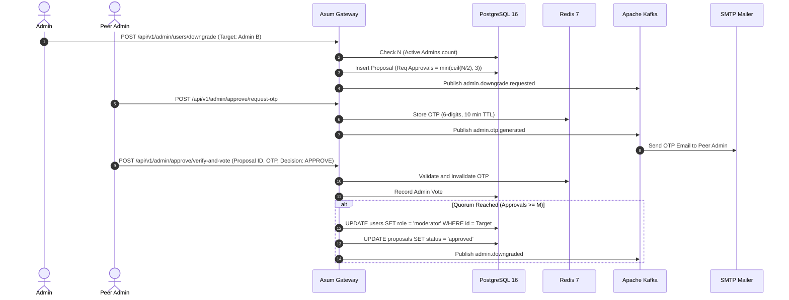

# Business & Product Specification

**Project**: CSAC Timetable Studio 🎵📅  
**Document Status**: Active / Single Source of Truth (SSOT)  
**Last Updated**: September 2026

---

## 1. Product Vision & Value Proposition

### 1.1 Executive Summary
**CSAC Timetable Studio** is an enterprise-grade automated scheduling and member management system created for university music clubs, bands, and cultural performance groups (specifically CSAC — Club of Songs And Culture). 

The platform provides:
1. **Club Administration & User Directory (`/admin/*`)**: Role-based user onboarding (with initial credential email dispatch) and dynamic promotion/demotion governance.
2. **Voting Event Lifecycle Management (`/admin/events`, `/events/[id]/vote`)**: Creating structured time-window events for member availability voting and automatic voting closures.
3. **Multi-Admin Quorum Demotion Protocol (`/admin/approve`)**: Cryptographically verified peer-review governance requiring OTP approval from peer administrators before an Admin can be downgraded.
4. **Standalone Utility Suite (`/utils/*`)**: Instant, conflict-free rehearsal timetable generation via CSP heuristics, multi-tab Excel ingestion, and 3-sheet Excel reporting.

---

## 2. Role-Based Access Control (RBAC) & Governance Rules

### 2.1 Role Hierarchy & Capabilities

| Role | Scope & Permissions | Key User Flows |
| :--- | :--- | :--- |
| **Admin** | Full system governance: Manage users, promote/demote roles, create & close voting events, vote on events, access `/utils/*`. | User onboarding, quorum ballot reviews, system audit inspection. |
| **Moderator** | Event operations: Create voting events, define time slots & date ranges, close events to stop voting, vote on events, access `/utils/*`. | Event creation, schedule finalization, voting monitoring. |
| **Member** | Performer participation: Vote in open events (`/events/[id]/vote`), view personal schedules, access `/utils/*`. | Availability submission, timetable inspection. |

### 2.2 Business Rules for Administration

* **BR-ADM-01 (User Onboarding & Credential Dispatch)**:
  * When an Admin creates a user (Name, Email, Role), the system generates a secure initial password.
  * The password is encrypted with **Argon2id** for database storage.
  * An asynchronous event is dispatched to send the user their login credentials via SMTP email.
* **BR-ADM-02 (Promotion Authority)**:
  * Any active Admin can promote a Member to Moderator or Admin immediately.
  * Any active Admin can promote a Moderator to Admin immediately.
* **BR-ADM-03 (Admin Downgrade Quorum Protocol)**:
  * Downgrading an Admin (to Moderator or Member) **cannot** be executed unilaterally.
  * Initiating a downgrade creates an **Admin Downgrade Proposal** with status `PENDING`.
  * The required approval count $M$ is calculated as:
    $$M = \min\left(\left\lceil \frac{N}{2} \right\rceil, 3\right)$$
    where $N$ is the total count of active Admins at the time of proposal creation.
  * **Sole Admin Protection**: If $N = 1$, downgrade proposals are strictly prohibited.
  * **Peer Review & Self-Resignation**: An Admin can initiate a demotion on any Admin or on themselves (self-resignation).
  * **OTP Verification**: To approve/reject, each peer Admin requests a 6-digit one-time password (OTP) sent to their email (TTL: 10 minutes) and submits it at `/admin/approve`.
  * Once $M$ approvals are collected, the target user's role is downgraded in PostgreSQL and audit logs are recorded.

---

## 3. Event Management & Voting Rules

* **BR-EVT-01 (Event Creation & Date Range)**:
  * Admins and Moderators can create voting events with a title, description, start date, end date, and customizable time slots (e.g., 17h-18h, 18h-19h).
  * Events are created in status `OPEN` (or `DRAFT`).
* **BR-EVT-02 (Voting Window & Invariant)**:
  * While status is `OPEN`, registered Members can cast/update their availability.
* **BR-EVT-03 (Event Closing)**:
  * Admins and Moderators can transition an event status to `CLOSED`.
  * Once `CLOSED`, all subsequent vote submissions are rejected immediately.
  * Closed events serve as input data to generate optimized rehearsal timetables.

---

## 4. Standalone Utilities Suite (`/utils/*`)

All original client-side timetable generation and Excel tools reside under `/utils/*`:
* **BR-UTL-01 (`/utils/timetable`)**: The primary automated CSP timetable solver, interactive pastel calendar grid, manual slot override, and conflict resolver modal.
* **BR-UTL-02 (`/utils/inspector`)**: Multi-sheet workbook inspector and sheet selector.
* **BR-UTL-03 (Zero Double-Booking Guarantee)**: A member **shall never** be scheduled for two different songs in the same day/time slot.
* **BR-UTL-04 (Room Allocation Limit)**: Total concurrent sessions **shall not** exceed `maxRooms` (default: 1 room).
* **BR-UTL-05 (Excel Master Report)**: Generates 3-sheet `.xlsx` workbook (`LỊCH TẬP TUẦN`, `CHI TIẾT BÀI HÁT`, `LỊCH CÁ NHÂN`).

---

## 5. User Journey & Workflow Specifications

---

## 4. Internationalization (i18n) & Dual-Language Policy

* **Target Audience Inclusion**: CSAC includes performers, mentors, and international exchange members. Consequently, 100% of the platform interface must be natively available in both Vietnamese (`vi`) and English (`en`).
* **Zero Missing Copy Mandate**: All pages—including Studio Hub, User Governance, Quorum Approvals, Event Lifecycle, Member Voting Portal, Workbook Inspector, and Timetable Solver—must provide 100% complete, contextual translations. No raw English strings may leak into the Vietnamese experience, and no Vietnamese strings may leak into the English experience.
* **Persistent User Choice**: The selected language is remembered and synchronized via top-level URL state (`?lang=vi` or `?lang=en`) and machine environment detection, allowing easy sharing and consistent presentation.

