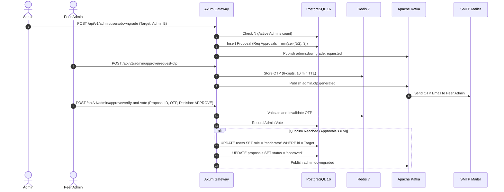

# Business & Product Specification

**Project**: CSAC Timetable Studio 🎵📅  
**Document Status**: Active / Single Source of Truth (SSOT)  
**Last Updated**: September 2026

---

## 1. Product Vision & Value Proposition

### 1.1 Executive Summary
**CSAC Timetable Studio** is an enterprise-grade automated scheduling and member management system created for university music clubs, bands, and cultural performance groups (specifically CSAC — Club of Songs And Culture). 

The platform provides:
1. **Show-Driven Music Production Studio (`/studio`)**: Centered around active Music Shows (`/studio/shows/[id]/*`) with dedicated sub-pages for Show Overview, Music Numbers (Kanban & QC audit), Practice Sprints (1-click free-time registration), and Show Roster.
2. **Independent Instrument Fleet & Custody (`/studio/gear`)**: Centralized dual-ownership instrument registry (club property & member-owned gear) and physical location tracking.
3. **Show Administration & Live Monitoring (`/admin/shows`)**: Show design, capacity planning, create modal, and live rehearsal monitor dashboard.
4. **User Governance Directory (`/admin/users`)**: Role-based user onboarding (Argon2id auth) and dynamic promotion/demotion authority.
5. **Multi-Admin Quorum Demotion Protocol (`/admin/approve`)**: Cryptographically verified peer-review governance requiring OTP approval from peer administrators before an Admin can be downgraded.
6. **Legacy Code Deprecation**: Standalone utility routes (`/utils/*`) and voting event routes (`/events/*`) are eliminated and replaced by show-driven practice sprints.

---

## 2. Role-Based Access Control (RBAC) & Governance Rules

### 2.1 Role Hierarchy & Capabilities

| Role | Scope & Permissions | Key User Flows |
| :--- | :--- | :--- |
| **Admin** | Full system governance: Manage users, promote/demote roles, create & close voting events, vote on events, access `/utils/*`. | User onboarding, quorum ballot reviews, system audit inspection. |
| **Moderator** | Event operations: Create voting events, define time slots & date ranges, close events to stop voting, vote on events, access `/utils/*`. | Event creation, schedule finalization, voting monitoring. |
| **Member** | Performer participation: Vote in open events (`/events/[id]/vote`), view personal schedules, access `/utils/*`. | Availability submission, timetable inspection. |

### 2.2 Business Rules for Administration

* **BR-ADM-01 (User Onboarding & Credential Dispatch)**:
  * When an Admin creates a user (Name, Email, Role), the system generates a secure initial password.
  * The password is encrypted with **Argon2id** for database storage.
  * An asynchronous event is dispatched to send the user their login credentials via SMTP email.
* **BR-ADM-02 (Promotion Authority)**:
  * Any active Admin can promote a Member to Moderator or Admin immediately.
  * Any active Admin can promote a Moderator to Admin immediately.
* **BR-ADM-03 (Admin Downgrade Quorum Protocol)**:
  * Downgrading an Admin (to Moderator or Member) **cannot** be executed unilaterally.
  * Initiating a downgrade creates an **Admin Downgrade Proposal** with status `PENDING`.
  * The required approval count $M$ is calculated as:
    $$M = \min\left(\left\lceil \frac{N}{2} \right\rceil, 3\right)$$
    where $N$ is the total count of active Admins at the time of proposal creation.
  * **Sole Admin Protection**: If $N = 1$, downgrade proposals are strictly prohibited.
  * **Peer Review & Self-Resignation**: An Admin can initiate a demotion on any Admin or on themselves (self-resignation).
  * **OTP Verification**: To approve/reject, each peer Admin requests a 6-digit one-time password (OTP) sent to their email (TTL: 10 minutes) and submits it at `/admin/approve`.
  * Once $M$ approvals are collected, the target user's role is downgraded in PostgreSQL and audit logs are recorded.

---

## 3. Event Management & Voting Rules

* **BR-EVT-01 (Event Creation & Date Range)**:
  * Admins and Moderators can create voting events with a title, description, start date, end date, and customizable time slots (e.g., 17h-18h, 18h-19h).
  * Events are created in status `OPEN` (or `DRAFT`).
* **BR-EVT-02 (Voting Window & Invariant)**:
  * While status is `OPEN`, registered Members can cast/update their availability.
* **BR-EVT-03 (Event Closing)**:
  * Admins and Moderators can transition an event status to `CLOSED`.
  * Once `CLOSED`, all subsequent vote submissions are rejected immediately.
  * Closed events serve as input data to generate optimized rehearsal timetables.

---

## 4. Standalone Utilities Suite (`/utils/*`)

All original client-side timetable generation and Excel tools reside under `/utils/*`:
* **BR-UTL-01 (`/utils/timetable`)**: The primary automated CSP timetable solver, interactive pastel calendar grid, manual slot override, and conflict resolver modal.
* **BR-UTL-02 (`/utils/inspector`)**: Multi-sheet workbook inspector and sheet selector.
* **BR-UTL-03 (Zero Double-Booking Guarantee)**: A member **shall never** be scheduled for two different songs in the same day/time slot.
* **BR-UTL-04 (Room Allocation Limit)**: Total concurrent sessions **shall not** exceed `maxRooms` (default: 1 room).
* **BR-UTL-05 (Excel Master Report)**: Generates 3-sheet `.xlsx` workbook (`LỊCH TẬP TUẦN`, `CHI TIẾT BÀI HÁT`, `LỊCH CÁ NHÂN`).

---

## 5. User Journey & Workflow Specifications

---

## 6. CSAC Music Production, Agile Practice SDLC & Instrument Fleet Governance

### 6.1 Music Numbers & Leadership Model
* **Delivery Manager (DM)**: Oversees the overall music event lineup, cross-number rehearsals, instrument allocation heatmap, and final stage-readiness audits across all numbers.
* **Performance Manager (PM)**: Directly responsible for a single **Music Number** (song/performance). Assigns performers, sets song target frequencies, coordinates rehearsal objectives, and assigns Quality Check (QC) reviewers.
* **Performers / Band Members**: Club musicians assigned to specific musical roles (e.g., Lead Vocal, Backing Vocal, Electric Guitar, Acoustic Guitar, Bass, Keyboard/Piano, Drum Kit, Percussion).

### 6.2 Agile Practice SDLC (Software Development Life Cycle for Music)
Each music event is divided into **Practice Sprints** (typically 1 to 2 weeks per sprint) mirroring the Agile SDLC:
1. **Sprint Planning & Free-Time Registration**:
   - Members register their available time slots for the active sprint via an ergonomic 1-click grid.
   - PMs define weekly sprint objectives and requested rehearsal sessions.
2. **Study & Create Tasks**:
   - **Study Task**: Individual member homework (e.g., memorizing vocal melodies, studying guitar chords/tabs, mastering drum fills).
   - **Create Task**: Collaborative arrangement tasks (e.g., recording demo scratch tracks, creating backing tracks, harmonizing vocal parts, band jamming).
3. **Review Task (Quality Check / QC)**:
   - **BR-PRC-01 (Mandatory QC Reviewer Assignment)**: Every review task must have at least one designated QC Reviewer assigned by the PM (or DM).
   - **BR-PRC-02 (Verifiable Quality Verdict)**: A song cannot be approved for stage performance without passing its milestone QC audit. The assigned QC Reviewer submits an explicit decision (`passed`, `in_progress`, or `blocked`) accompanied by constructive critique and feedback notes.
   - **Music Number Lifecycle**: `draft` $\rightarrow$ `in_practice` $\rightarrow$ `ready_for_qc` $\rightarrow$ `qc_approved` $\rightarrow$ `stage_ready`.

### 6.3 Dual-Ownership Instrument Fleet Management & Conflict Invariant
To prevent showstopper rehearsal clashes and equipment loss, the organization maintains a centralized equipment registry:
* **BR-INS-01 (Ownership Classification)**:
  - **CSAC Property (`club_property`)**: Instruments and audio equipment owned by the club (e.g., club drums, stage mics, master keyboards, PA gear).
  - **Member-Owned Gear (`member_owned`)**: Personal instruments brought by members (e.g., member's custom bass guitar, boutique amplifier, synthesizers). The owner is explicitly identified by `owner_user_id`.
* **BR-INS-02 (Borrowing Policy & Status Flags)**:
  - `free_to_borrow`: Available for any music number in the club to reserve during practice or stage sessions.
  - `in_use`: Currently allocated to an ongoing rehearsal or live performance.
  - `unavailable`: Strictly reserved for the owner's personal numbers or private use; not open for general club loan.
  - `in_maintenance`: Damaged, undergoing string replacement, tuning, or repair.
* **BR-INS-03 (Custody & Physical Location Tracking)**:
  - Every piece of gear tracks `custody_user_id` ("kept by whom") or location note (e.g., "Club Studio Locker A", "Kept by Minh Pháp") to ensure total physical accountability and eliminate missing gear after late-night rehearsals.
* **BR-INS-04 (Zero Double-Booking Conflict Invariant)**:
  - A physical instrument **shall never** be concurrently reserved for two different music numbers in the same day and time slot, whether during practice rehearsals or live stage performances. Any conflicting reservation attempt is rejected with a conflict error.

---

## 7. Internationalization (i18n) & Dual-Language Policy

* **Target Audience Inclusion**: CSAC includes performers, mentors, and international exchange members. Consequently, 100% of the platform interface must be natively available in both Vietnamese (`vi`) and English (`en`).
* **Zero Missing Copy Mandate**: All pages—including Studio Hub, User Governance, Quorum Approvals, Event Lifecycle, Member Voting Portal, Workbook Inspector, and Timetable Solver—must provide 100% complete, contextual translations. No raw English strings may leak into the Vietnamese experience, and no Vietnamese strings may leak into the English experience.
* **Persistent User Choice**: The selected language is remembered and synchronized via top-level URL state (`?lang=vi` or `?lang=en`) and machine environment detection, allowing easy sharing and consistent presentation.

