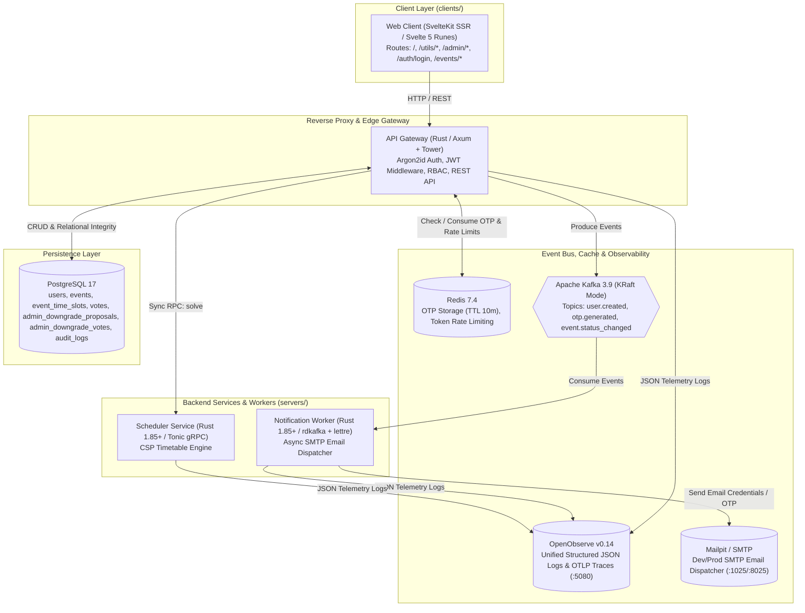

# Technical Architecture & Engineering Specification

**Project**: CSAC Timetable Studio 🎵📅  
**Document Status**: Active / Single Source of Truth (SSOT)  
**Last Updated**: September 2026

---

## 1. System Architecture & Tech Stack

### 1.1 Architecture Overview
CSAC Timetable Studio is architected as a production-grade multi-service monorepo:



---

## 2. Database Schema (PostgreSQL 16)

```sql
-- Role and Status Enums
CREATE TYPE user_role AS ENUM ('admin', 'moderator', 'member');
CREATE TYPE user_status AS ENUM ('active', 'suspended');
CREATE TYPE event_status AS ENUM ('draft', 'open', 'closed');
CREATE TYPE proposal_status AS ENUM ('pending', 'approved', 'rejected', 'expired');
CREATE TYPE vote_decision AS ENUM ('approve', 'reject');

-- 1. Users Table
CREATE TABLE users (
    id UUID PRIMARY KEY DEFAULT gen_random_uuid(),
    email VARCHAR(255) NOT NULL UNIQUE,
    full_name VARCHAR(255) NOT NULL,
    password_hash VARCHAR(255) NOT NULL, -- Argon2id hash
    role user_role NOT NULL DEFAULT 'member',
    status user_status NOT NULL DEFAULT 'active',
    created_at TIMESTAMPTZ NOT NULL DEFAULT NOW(),
    updated_at TIMESTAMPTZ NOT NULL DEFAULT NOW()
);

-- 2. Events Table
CREATE TABLE events (
    id UUID PRIMARY KEY DEFAULT gen_random_uuid(),
    title VARCHAR(255) NOT NULL,
    description TEXT,
    start_date DATE NOT NULL,
    end_date DATE NOT NULL,
    status event_status NOT NULL DEFAULT 'open',
    created_by UUID REFERENCES users(id) ON DELETE SET NULL,
    created_at TIMESTAMPTZ NOT NULL DEFAULT NOW(),
    closed_at TIMESTAMPTZ
);

-- 3. Event Time Slots Table
CREATE TABLE event_time_slots (
    id UUID PRIMARY KEY DEFAULT gen_random_uuid(),
    event_id UUID NOT NULL REFERENCES events(id) ON DELETE CASCADE,
    day_of_week VARCHAR(50) NOT NULL,
    slot_label VARCHAR(100) NOT NULL,
    sort_order INT NOT NULL DEFAULT 0,
    created_at TIMESTAMPTZ NOT NULL DEFAULT NOW()
);

-- 4. Member Votes Table
CREATE TABLE votes (
    id UUID PRIMARY KEY DEFAULT gen_random_uuid(),
    event_id UUID NOT NULL REFERENCES events(id) ON DELETE CASCADE,
    user_id UUID NOT NULL REFERENCES users(id) ON DELETE CASCADE,
    slot_id UUID NOT NULL REFERENCES event_time_slots(id) ON DELETE CASCADE,
    is_available BOOLEAN NOT NULL DEFAULT TRUE,
    note TEXT,
    updated_at TIMESTAMPTZ NOT NULL DEFAULT NOW(),
    CONSTRAINT unique_user_event_slot UNIQUE (event_id, user_id, slot_id)
);

-- 5. Admin Downgrade Proposals
CREATE TABLE admin_downgrade_proposals (
    id UUID PRIMARY KEY DEFAULT gen_random_uuid(),
    target_admin_id UUID NOT NULL REFERENCES users(id) ON DELETE CASCADE,
    target_role user_role NOT NULL DEFAULT 'moderator',
    initiated_by UUID NOT NULL REFERENCES users(id) ON DELETE CASCADE,
    reason TEXT NOT NULL,
    total_admins_at_proposal INT NOT NULL,
    required_approvals INT NOT NULL,
    current_approvals INT NOT NULL DEFAULT 0,
    status proposal_status NOT NULL DEFAULT 'pending',
    created_at TIMESTAMPTZ NOT NULL DEFAULT NOW(),
    expires_at TIMESTAMPTZ NOT NULL DEFAULT (NOW() + INTERVAL '7 days')
);

-- 6. Admin Downgrade Quorum Votes
CREATE TABLE admin_downgrade_votes (
    id UUID PRIMARY KEY DEFAULT gen_random_uuid(),
    proposal_id UUID NOT NULL REFERENCES admin_downgrade_proposals(id) ON DELETE CASCADE,
    admin_id UUID NOT NULL REFERENCES users(id) ON DELETE CASCADE,
    decision vote_decision NOT NULL,
    voted_at TIMESTAMPTZ NOT NULL DEFAULT NOW(),
    CONSTRAINT unique_proposal_admin UNIQUE (proposal_id, admin_id)
);

-- 7. Audit Logs Table
CREATE TABLE audit_logs (
    id UUID PRIMARY KEY DEFAULT gen_random_uuid(),
    actor_id UUID REFERENCES users(id) ON DELETE SET NULL,
    action VARCHAR(100) NOT NULL,
    resource_type VARCHAR(100) NOT NULL,
    resource_id UUID,
    metadata JSONB,
    created_at TIMESTAMPTZ NOT NULL DEFAULT NOW()
);
```

---

## 3. Security, Authentication & Cryptography

### 3.1 Argon2id Password Hashing
- **Algorithm**: `Argon2id` (RFC 9106)
- **Parameters**:
  - Memory: $19\text{ MiB}$ ($19456\text{ KiB}$)
  - Iterations: $2$
  - Parallelism: $1$
  - Salt: $16$ cryptographically secure random bytes

### 3.2 JWT Token Architecture
- **Header**: `{"alg": "HS256", "typ": "JWT"}`
- **Payload Claims**:
  ```json
  {
    "sub": "uuid-user-id",
    "email": "user@csac.local",
    "name": "Member Name",
    "role": "admin" | "moderator" | "member",
    "exp": 1780000000,
    "iat": 1779000000
  }
  ```
- **Transmission**: `Authorization: Bearer <token>` or HttpOnly cookie `csac_session`.

### 3.3 Redis OTP Storage Protocol
- **Key Pattern**: `otp:admin:{admin_id}:{proposal_id}`
- **Value**: `{"code": "6-digit-string", "attempts": 0}`
- **TTL**: $600\text{ seconds}$ (10 minutes).
- **Rate Limit**: Max 3 incorrect attempts before key invalidation.

---

## 4. REST API Endpoint Specifications

### 4.1 Authentication (`/api/v1/auth`)
* `POST /api/v1/auth/login`: `{ email, password }` $\rightarrow$ `{ token, user: { id, email, full_name, role } }`.
* `GET /api/v1/auth/me`: Validates JWT $\rightarrow$ returns current user profile.

### 4.2 Admin User Management (`/api/v1/admin/users`) — *Admin Only*
* `GET /api/v1/admin/users`: List users with pagination and role filter.
* `POST /api/v1/admin/users`: Create user `{ email, full_name, role }` $\rightarrow$ generates random password, hashes with Argon2id, writes to DB, emits Kafka `csac.user.created` event.
* `PUT /api/v1/admin/users/:id/role`: Change user role to `moderator` or `admin` (or initiate downgrade proposal if target is `admin`).
* `POST /api/v1/admin/users/:id/downgrade-proposal`: Create downgrade proposal `{ target_role, reason }` $\rightarrow$ calculates required approvals $M = \min(\lceil N/2 \rceil, 3)$.

### 4.3 Admin Quorum Approval (`/api/v1/admin/approve`) — *Admin Only*
* `GET /api/v1/admin/approve/proposals`: List all pending and historical downgrade proposals.
* `POST /api/v1/admin/approve/:proposal_id/request-otp`: Generates 6-digit OTP in Redis and sends via Kafka `csac.admin.otp_generated`.
* `POST /api/v1/admin/approve/:proposal_id/vote`: Submit `{ otp, decision: 'approve' | 'reject' }` $\rightarrow$ checks OTP, records vote, updates role if quorum met.

### 4.4 Event Management (`/api/v1/events`) — *Admin & Moderator*
* `GET /api/v1/events`: List events.
* `POST /api/v1/events`: Create event `{ title, description, start_date, end_date, time_slots: [...] }`.
* `PUT /api/v1/events/:id/close`: Close event $\rightarrow$ prevents further voting.
* `GET /api/v1/events/:id/votes`: Retrieve voting matrix for event.
* `POST /api/v1/events/:id/vote`: Submit member vote `{ slot_id, is_available, note }` *(Any authenticated user if event is open)*.

---

## 5. Observability & Telemetry (OpenObserve)

* **OpenObserve Service**: Deployed on port `5080` (HTTP web console & API), with user/password credentials configured via container environment.
* **Structured Tracing**: All Rust Axum endpoints emit JSON logs containing:
  ```json
  {
    "timestamp": "2026-09-11T00:45:00Z",
    "level": "INFO",
    "service": "gateway",
    "request_id": "req-12345",
    "method": "POST",
    "path": "/api/v1/admin/users",
    "status": 201,
    "user_id": "uuid-admin-id",
    "role": "admin",
    "latency_ms": 12.4
  }
  ```
* **Log Shipper**: Services stream structured logs to OpenObserve via HTTP endpoint `http://openobserve:5080/api/default/default/_json`.

---

## 6. SvelteKit Web Route Restructuring

* `/`: Landing portal with Quick Access Bento cards.
* `/auth/login`: Bento-styled modern login card with True Orange accents.
* `/utils/timetable`: Existing full timetable solver, pastel cards, sheet selector modal, conflict resolver, and Excel exporter.
* `/utils/inspector`: Excel workbook multi-tab inspector.
* `/admin/users`: User management table, role modal, user onboarding form.
* `/admin/events`: Event creation wizard, voting status toggle (Open/Close), slot configuration.
* `/admin/approve`: Quorum approval cards, interactive OTP modal, ballot progress bar ($k / M$ votes).
* `/events/[id]/vote`: Performer availability voting matrix.

---

## 7. Internationalization (i18n) Architecture & Standards

### 7.1 ISO 639-1 Compliance & Zero-Dependency Svelte 5 Runes Engine
* **Supported Locales**: Strictly standardized on ISO 639-1 two-letter codes:
  * `vi`: Vietnamese (Tiếng Việt 🇻🇳)
  * `en`: English (English 🇺🇸)
* **Zero Hardcoded Display Text Rule**: Every single user-visible string across all routes (`/`, `/auth/*`, `/admin/*`, `/events/*`, `/utils/*`) must be rendered using reactive translations via `$tStore('namespace.key')` or `translate(locale, 'namespace.key', params)`. Hardcoded template text is strictly prohibited.
* **1-to-1 Translation Parity**: Dictionaries (`clients/web/src/lib/i18n/locales/vi.ts` and `clients/web/src/lib/i18n/locales/en.ts`) must maintain exact symmetric key parity. Automated tests validate 100% mutual presence and fail if any key is missing in either dictionary.
* **Key Namespaces**:
  * `hub`: Landing page hero, tags, descriptions, CTA buttons, and Bento card modules.
  * `auth`: Login card, form fields, placeholders, action buttons, error messages.
  * `admin_users`: User directory, role promotion, downgrade proposals, credentials dispatch.
  * `admin_approve`: Multi-admin quorum approval ballots, OTP verification modal, voting decisions.
  * `admin_events`: Rehearsal voting events lifecycle, slot builder, date ranges.
  * `events_vote`: Performer interactive availability matrix, slot checkboxes, submission feedback.
  * `inspector`: Excel workbook validator, sheet previews, integrity inspection.
  * `nav`: Studio app switcher dropdown, auth badges, profile indicators, mobile navigation.
  * `navbar`, `days`, `sidebar`, `calendar`, `upload_modal`, `sheet_modal`, `conflict_modal`, `event_detail_modal`, `slot_add_modal`, `raw_vote_modal`, `messages`: Core timetable scheduler engine and solver dialogs.

