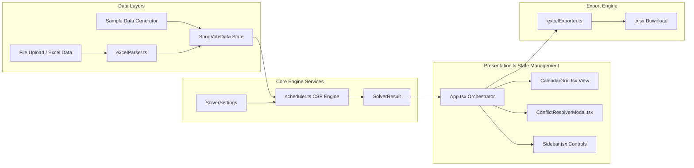

# Technical Architecture & Engineering Specification

**Project**: CSAC Timetable Studio 🎵📅  
**Document Status**: Active / Single Source of Truth (SSOT)  
**Last Updated**: September 2026

---

## 1. System Architecture & Tech Stack

### 1.1 Architecture Overview
CSAC Timetable Studio is a client-side Web Application written in **React 19** and **TypeScript**, packaged with **Vite 8**. It operates completely locally in the browser, ensuring user data privacy and zero server latency.



### 1.2 Technology Stack

| Layer | Component | Version / Library | Purpose |
| :--- | :--- | :--- | :--- |
| **Core Framework** | React | `^19.2.8` | Declarative UI rendering & state management. |
| **Language** | TypeScript | `~6.0.2` | Strict type safety and data contract enforcement. |
| **Build & Tooling** | Vite | `^8.2.2` | Fast HMR dev server & production bundling. |
| **Excel Parser** | SheetJS (`xlsx`) | `^0.18.5` | In-memory parsing & multi-sheet inspection. |
| **Excel Exporter** | `exceljs` | `^4.4.0` | Rich styled Excel export (colors, borders, fonts). |
| **Icons** | `lucide-react` | `^1.41.0` | Modern UI icon library. |
| **Testing** | `tsx` | `^4.23.13` | Automated headless Node CLI test runner. |
| **Styling** | Vanilla CSS | CSS Grid / Variables | Responsive Google Calendar-styled UI design. |

---

## 2. Core Data Models (`src/types/timetable.ts`)

### 2.1 Domain Entities

```typescript
export type DayOfWeek = 
  | 'THỨ HAI' | 'THỨ BA' | 'THỨ TƯ' | 'THỨ NĂM' 
  | 'THỨ SÁU' | 'THỨ BẢY' | 'CHỦ NHẬT';

export interface PastelColor {
  id: string;
  name: string;
  bg: string;
  border: string;
  text: string;
  chipBg: string;
}

export interface SongVoteData {
  id: string;
  name: string;
  weekTitle: string;
  members: string[];
  // Composite key: `${day}__${slot}__${member}` -> boolean
  availability: Record<string, boolean>;
  // Composite key: `${day}__${slot}` -> note string
  notes: Record<string, string>;
  color: PastelColor;
  targetSessions: number; // Configurable practice count per week
  sourceFileName?: string;
}

export interface ScheduledSession {
  id: string;
  songId: string;
  songName: string;
  day: DayOfWeek;
  slot: string; // e.g. '17h - 18h'
  room: number; // 1, 2, etc.
  allMembers: string[];
  availableMembers: string[];
  absentMembers: string[];
  color: PastelColor;
  note?: string;
  isManual?: boolean;
}

export interface SolverSettings {
  maxRooms: number;              // Default 1 room
  allowPartialAttendance: boolean; // Fallback if 100% attendance impossible
  spreadDays: boolean;            // Prefer distinct days for multiple sessions
}

export interface SolverResult {
  schedule: ScheduledSession[];
  unresolved: UnresolvedSong[];
  conflicts: ConflictItem[];
  stats: {
    totalRequested: number;
    totalScheduled: number;
    perfectAttendanceCount: number;
    partialAttendanceCount: number;
  };
}
```

---

## 3. Algorithm Specifications

### 3.1 CSP Solver Engine (`src/services/scheduler.ts`)

The main solver function `solveTimetable()` runs a multi-pass heuristic algorithm:

```typescript
export function solveTimetable(
  songs: SongVoteData[],
  settings: SolverSettings,
  days: DayOfWeek[] = DAYS_OF_WEEK,
  timeSlots: string[] = DEFAULT_TIME_SLOTS,
  manualFixedSessions: ScheduledSession[] = []
): SolverResult
```

#### Step-by-Step Execution Flow
1. **Initialize Grid & Fixed Sessions**: Build slot occupancy map `Map<"${day}__${slot}", ScheduledSession[]>`. Retain manual fixed sessions provided by user.
2. **Calculate Session Requirements**: Expand song target frequencies into discrete session units `neededSessions`.
3. **MRV Ordering (Most Constrained Variable First)**:
   * Calculate `perfectCount` (number of candidate 100%-attendance slots) for each song.
   * Sort `neededSessions` by:
     1. Ascending candidate slots (songs with fewer choices scheduled first).
     2. Descending team member count (larger bands scheduled first).
4. **Pass 1 — Strict 100% Attendance Placement**:
   * For each session, evaluate available slots using `canPlaceSong()`.
   * Score candidates using **LCV (Least Constraining Value)**:
     $$\text{Score} = 100 - \text{OtherSongDemand}$$
   * Assign session to the slot with the highest score.
5. **Pass 2 — Fallback Partial Attendance Placement** (if enabled):
   * If a session could not be placed in Pass 1 and `allowPartialAttendance === true`, attempt placement allowing at most 1 missing member:
     $$\text{Score} = \left( \frac{|\text{AvailableMembers}|}{|\text{TotalMembers}|} \right) \times 80$$
6. **Conflict Detection**:
   * Any unplaced sessions are collected into `unresolved` array along with candidate slot rankings and clear reasons (e.g. "Room limit exceeded", "Member overlap with Song X").

---

## 4. Subsystem Details

### 4.1 Excel Parser (`src/services/excelParser.ts`)
* **Multi-Tab Inspection**: `inspectExcelFiles(files: File[])` returns `FileInspection[]` containing workbook structure without consuming memory for full sheet processing.
* **Selective Sheet Parser**: `parseSelectedSheets(inspections, selectedKeys)` parses only sheets matching key `${fileId}::${sheetName}`.
* **Matrix Normalization**: Standardizes Vietnamese day names (`THỨ HAI` to `CHỦ NHẬT`), slot time strings (`17h - 18h`), and member column layouts.

### 4.2 Excel Exporter (`src/services/excelExporter.ts`)
Uses `exceljs` to generate 3 formatted worksheets:
1. `LỊCH TẬP TUẦN`: Weekly grid layout with background colors matching `PASTEL_PALETTE`.
2. `CHI TIẾT BÀI HÁT`: Tabular summary of scheduled sessions.
3. `LỊCH CÁ NHÂN`: Individual member timetables.

---

## 5. Verification & Testing

### 5.1 Test Suite Structure (`test_system.ts`)
The project includes an automated Node.js test runner covering 38 assertions:

```bash
npx tsx test_system.ts
```

| Test # | Focus Area | Assertions Verified |
| :--- | :--- | :--- |
| **TEST 1** | Sample Data Generation | 5 sample songs, member overlap detection. |
| **TEST 2** | Solver Core Constraints | Zero double-bookings, 100% attendance enforcement. |
| **TEST 3** | Configurable Frequencies & Conflicts | Custom frequencies (3x/week) and extreme capacity overload detection. |
| **TEST 4** | Excel Parser Round-Trip | Synthetic sheet parsing & Vietnamese character support. |
| **TEST 5** | Excel Exporter | 3-sheet workbook generation & valid binary buffer. |
| **TEST 6** | Sample File Generation | In-memory `.xlsx` generation for multi-tab and single-tab files. |
| **TEST 7** | Multi-Tab Inspection | Sheet metadata discovery and multi-tab flag detection. |
| **TEST 8** | Selective Tab Parsing | Partial sheet importing and schedule solving. |

**Execution Result**: `38 PASSED, 0 FAILED`.
