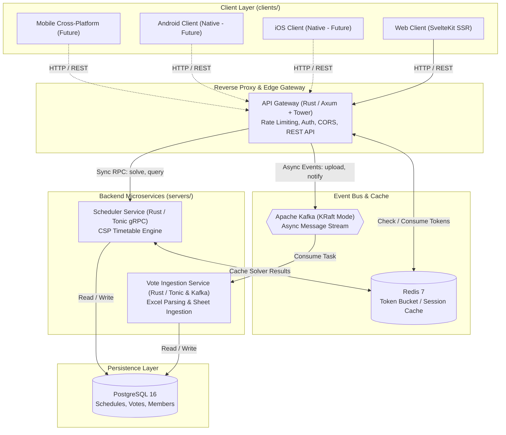

# Technical Architecture & Engineering Specification

**Project**: CSAC Timetable Studio 🎵📅  
**Document Status**: Active / Single Source of Truth (SSOT)  
**Last Updated**: September 2026

---

## 1. System Architecture & Tech Stack
 
### 1.1 Architecture Overview
CSAC Timetable Studio is architected as a modular multi-service monorepo:
1. **Clients (`clients/`)**:
   - `clients/web`: Web Frontend implemented with **SvelteKit** (Svelte 5 Runes, SSR, progressive enhancement Form Actions) replacing the legacy vanilla/React client.
   - Placeholders for future platforms (`ios`, `android`, `mobile-cross`).
2. **Servers (`servers/`)**:
   - High-performance Rust microservices workspace.
   - `gateway`: Unified reverse proxy / API Gateway built on **Axum** and **Tower** exposing standard RESTful HTTP endpoints with rate-limiting, CORS, authentication, and security headers.
   - Downstream services communicated synchronously via **gRPC (Tonic)** with Protobuf definitions.
   - Downstream asynchronous operations (ingestion, bulk tasks, notifications) processed via **Apache Kafka (rdkafka)**.
   - Persistence layer backed by **PostgreSQL 16** (relational data) and **Redis 7** (caching, session store, rate-limiting tokens).
3. **Infrastructure (`deploy/`)**:
   - Containerized deployment powered by `deploy/compose.yml` orchestrating Kafka in KRaft mode, PostgreSQL, Redis, Gateway, and Web SSR containers.



### 1.2 Technology Stack

| Subsystem | Layer | Technology / Library | Purpose |
| :--- | :--- | :--- | :--- |
| **Clients** | Web Frontend | SvelteKit + Svelte 5 | Modern reactive UI, SSR, Form Actions, runes (`$state`, `$derived`). |
| **Clients** | Web Styling & UI | Neumorphism / Soft UI System | Physical extruded/pressed materiality (`#e0e5ec`), dual-shadow elevation, crisp typography. |
| **Clients** | Web Excel Engine | SheetJS (`xlsx`) + `exceljs` | Multi-sheet parsing and styled workbook generation. |
| **Servers** | API Gateway | Rust (`axum`, `tower`, `tower-http`) | Unified reverse proxy, rate limiting, REST routing, CORS, JWT. |
| **Servers** | Inter-Service Sync | Rust (`tonic`, `prost`) | Low-latency type-safe gRPC remote procedure calls. |
| **Servers** | Inter-Service Async | Rust (`rdkafka`) + Kafka KRaft | Scalable asynchronous event-driven message bus. |
| **Servers** | Data Persistence | PostgreSQL 16 + SQLx | Type-safe compile-time verified database persistence. |
| **Servers** | Caching & Rates | Redis 7 + `redis-rs` | Distributed rate limiting, session storage, and solver result cache. |
| **Infra** | Orchestration | Docker & Compose | Multi-container local orchestration and deployment. |
| **Tooling** | Monorepo Governance | Antigravity Scoped Rules | Context-isolated agent rules per directory and domain. |

---

## 2. Core Data Models (`src/types/timetable.ts`)

### 2.1 Domain Entities

```typescript
export type DayOfWeek = 
  | 'THỨ HAI' | 'THỨ BA' | 'THỨ TƯ' | 'THỨ NĂM' 
  | 'THỨ SÁU' | 'THỨ BẢY' | 'CHỦ NHẬT';

export interface PastelColor {
  id: string;
  name: string;
  bg: string;
  border: string;
  text: string;
  chipBg: string;
}

export interface SongVoteData {
  id: string;
  name: string;
  weekTitle: string;
  members: string[];
  // Composite key: `${day}__${slot}__${member}` -> boolean
  availability: Record<string, boolean>;
  // Composite key: `${day}__${slot}` -> note string
  notes: Record<string, string>;
  color: PastelColor;
  targetSessions: number; // Configurable practice count per week
  sourceFileName?: string;
}

export interface ScheduledSession {
  id: string;
  songId: string;
  songName: string;
  day: DayOfWeek;
  slot: string; // e.g. '17h - 18h'
  room: number; // 1, 2, etc.
  allMembers: string[];
  availableMembers: string[];
  absentMembers: string[];
  color: PastelColor;
  note?: string;
  isManual?: boolean;
}

export interface SolverSettings {
  maxRooms: number;              // Default 1 room
  allowPartialAttendance: boolean; // Fallback if 100% attendance impossible
  spreadDays: boolean;            // Prefer distinct days for multiple sessions
}

export interface SolverResult {
  schedule: ScheduledSession[];
  unresolved: UnresolvedSong[];
  conflicts: ConflictItem[];
  stats: {
    totalRequested: number;
    totalScheduled: number;
    perfectAttendanceCount: number;
    partialAttendanceCount: number;
  };
}
```

---

## 3. Algorithm Specifications

### 3.1 CSP Solver Engine (`src/services/scheduler.ts`)

The main solver function `solveTimetable()` runs a multi-pass heuristic algorithm:

```typescript
export function solveTimetable(
  songs: SongVoteData[],
  settings: SolverSettings,
  days: DayOfWeek[] = DAYS_OF_WEEK,
  timeSlots: string[] = DEFAULT_TIME_SLOTS,
  manualFixedSessions: ScheduledSession[] = []
): SolverResult
```

#### Step-by-Step Execution Flow
1. **Initialize Grid & Fixed Sessions**: Build slot occupancy map `Map<"${day}__${slot}", ScheduledSession[]>`. Retain manual fixed sessions provided by user.
2. **Calculate Session Requirements**: Expand song target frequencies into discrete session units `neededSessions`.
3. **MRV Ordering (Most Constrained Variable First)**:
   * Calculate `perfectCount` (number of candidate 100%-attendance slots) for each song.
   * Sort `neededSessions` by:
     1. Ascending candidate slots (songs with fewer choices scheduled first).
     2. Descending team member count (larger bands scheduled first).
4. **Pass 1 — Strict 100% Attendance Placement**:
   * For each session, evaluate available slots using `canPlaceSong()`.
   * Score candidates using **LCV (Least Constraining Value)**:
     $$\text{Score} = 100 - \text{OtherSongDemand}$$
   * Assign session to the slot with the highest score.
5. **Pass 2 — Fallback Partial Attendance Placement** (if enabled):
   * If a session could not be placed in Pass 1 and `allowPartialAttendance === true`, attempt placement allowing at most 1 missing member:
     $$\text{Score} = \left( \frac{|\text{AvailableMembers}|}{|\text{TotalMembers}|} \right) \times 80$$
6. **Conflict Detection**:
   * Any unplaced sessions are collected into `unresolved` array along with candidate slot rankings and clear reasons (e.g. "Room limit exceeded", "Member overlap with Song X").

---

## 4. Subsystem Details

### 4.1 Excel Parser (`src/services/excelParser.ts`)
* **Multi-Tab Inspection**: `inspectExcelFiles(files: File[])` returns `FileInspection[]` containing workbook structure without consuming memory for full sheet processing.
* **Selective Sheet Parser**: `parseSelectedSheets(inspections, selectedKeys)` parses only sheets matching key `${fileId}::${sheetName}`.
* **Matrix Normalization**: Standardizes Vietnamese day names (`THỨ HAI` to `CHỦ NHẬT`), slot time strings (`17h - 18h`), and member column layouts.

### 4.2 Excel Exporter (`src/services/excelExporter.ts`)
Uses `exceljs` to generate 3 formatted worksheets:
1. `LỊCH TẬP TUẦN`: Weekly grid layout with background colors matching `PASTEL_PALETTE`.
2. `CHI TIẾT BÀI HÁT`: Tabular summary of scheduled sessions.
3. `LỊCH CÁ NHÂN`: Individual member timetables.

### 4.3 Web Frontend Bento Grid UI (`clients/web/`)
* **Design System**: Bento Grid UI layout using modular card surfaces, clean 1px borders, subtle elevation, and True Orange accent (`#ff6b00` / `#f97316`).
* **Design Skill & Rules**: Governed by `bento-design` skill (`.agents/skills/bento-design/SKILL.md`) and scoped rule `.agents/rules/web-frontend.md`.
* **70/20/10 Palette**: 70% deep neutral base (`#f8fafc`), 20% elevated white bento cards (`#ffffff`), 10% vivid True Orange accent. Zero neumorphic muddy dual-shadows.

### 4.4 Internationalization Subsystem (`clients/web/src/lib/i18n/`)
* **Standard Compliance**: ISO 639-1 standard identifiers (`vi`, `en`).
* **Core Types**:
  ```typescript
  export type Iso639_1Locale = 'vi' | 'en';
  export interface LanguageOption {
    code: Iso639_1Locale;
    nativeName: string;
    englishName: string;
    flag: string;
  }
  ```
* **Rune State**: Zero-dependency Svelte 5 rune reactive store (`$state` current locale, `$derived` active dictionary, dot-notation resolver `t(key, params)`).
* **URL Sync Flow**: Synchronized globally in `+layout.svelte` via `page.url.searchParams.get('lang')` and client browser locale fallback (`navigator.language`). Changes push URL state via `replaceState` without page reloads.


---

## 5. Verification & Testing

### 5.1 Test Suite Structure (`test_system.ts`)
The project includes an automated Node.js test runner covering 38 assertions:

```bash
npx tsx test_system.ts
```

| Test # | Focus Area | Assertions Verified |
| :--- | :--- | :--- |
| **TEST 1** | Sample Data Generation | 5 sample songs, member overlap detection. |
| **TEST 2** | Solver Core Constraints | Zero double-bookings, 100% attendance enforcement. |
| **TEST 3** | Configurable Frequencies & Conflicts | Custom frequencies (3x/week) and extreme capacity overload detection. |
| **TEST 4** | Excel Parser Round-Trip | Synthetic sheet parsing & Vietnamese character support. |
| **TEST 5** | Excel Exporter | 3-sheet workbook generation & valid binary buffer. |
| **TEST 6** | Sample File Generation | In-memory `.xlsx` generation for multi-tab and single-tab files. |
| **TEST 7** | Multi-Tab Inspection | Sheet metadata discovery and multi-tab flag detection. |
| **TEST 8** | Selective Tab Parsing | Partial sheet importing and schedule solving. |

**Execution Result**: `38 PASSED, 0 FAILED`.
