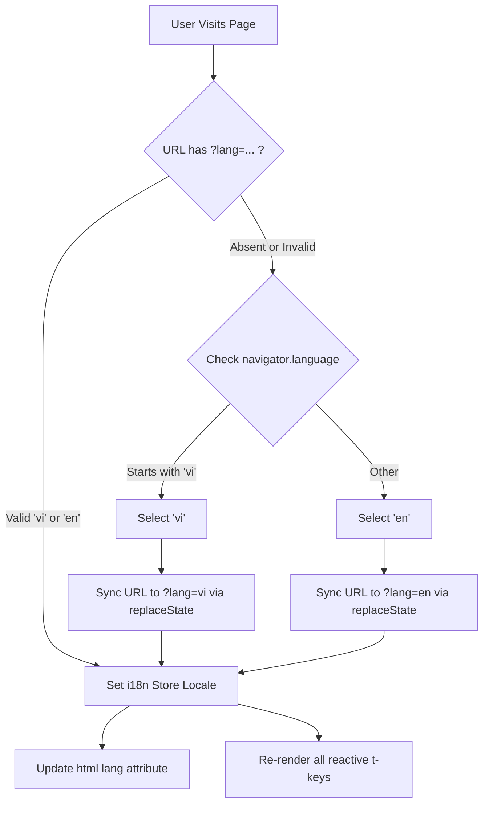

# Technical & Product Design Specification: Internationalization (i18n)

**Feature**: First-class English and Vietnamese i18n Adaptation  
**Branch**: `feat/i8n-adaptation`  
**Status**: Approved Spec  
**Standards Compliance**: ISO 639-1 (`vi`, `en`)  
**Date**: September 10, 2026  

---

## 1. Executive Summary & Goals

The `clients/web` application previously exclusively featured Vietnamese copy, limiting accessibility for non-Vietnamese performers, band leaders, or international exchange club members.

This specification introduces a zero-dependency, type-safe internationalization (i18n) subsystem with:
1. **First-class ISO 639-1 language support**: Vietnamese (`vi`) and English (`en`).
2. **Top-right language switcher dropdown**: Flag icon (`🇻🇳`, `🇺🇸`) with native language names ("Tiếng Việt", "English") situated in the navigation header.
3. **Locale resolution strategy**:
   - Machine locale auto-detection via `navigator.language`.
   - Global URL search parameter synchronization (`?lang=vi` / `?lang=en`) managed in `+layout.svelte`.
4. **Copywriting & context preservation**:
   - Elevated, idiomatic Vietnamese rehearsal-studio terminology.
   - Professional, musical-context-preserving English translations.

---

## 2. Standards & Contracts

### 2.1 ISO 639-1 Locale Definition
Supported language codes are strictly two-letter lowercase codes defined by the ISO 639-1 standard:
```typescript
export type Iso639_1Locale = 'vi' | 'en';

export interface LanguageOption {
  code: Iso639_1Locale;
  nativeName: string;
  englishName: string;
  flag: string; // Emoji representation 🇻🇳 / 🇺🇸
}

export const SUPPORTED_LANGUAGES: Record<Iso639_1Locale, LanguageOption> = {
  vi: {
    code: 'vi',
    nativeName: 'Tiếng Việt',
    englishName: 'Vietnamese',
    flag: '🇻🇳',
  },
  en: {
    code: 'en',
    nativeName: 'English',
    englishName: 'English',
    flag: '🇺🇸',
  },
};
```

---

## 3. Architecture & Data Flow

### 3.1 Svelte 5 Reactive i18n Store (`src/lib/i18n/`)
Instead of heavy third-party bundles, the i18n engine utilizes Svelte 5 runes (`$state`, `$derived`):
- `currentLocale`: Svelte reactive state holding `'vi' | 'en'`.
- `t(key: TranslationKey, params?: Record<string, string | number>): string`: Dot-notation translation resolver with interpolation replacement.
- `setLocale(locale: Iso639_1Locale)`: Updates state and dispatches URL param sync.

### 3.2 URL Search Parameter & Lifecycle Flow in `+layout.svelte`
1. On initial mount and route updates:
   - Check if `page.url.searchParams.get('lang')` matches `'vi'` or `'en'`.
   - If present and valid: activate that locale.
   - If absent: inspect `navigator.language`. If it begins with `'vi'`, choose `'vi'`; otherwise default to `'en'`.
   - Synchronize URL with `replaceState` without triggering page reloads, ensuring bookmarkable and shareable language links (`?lang=en`).
2. Update `<html lang="...">` dynamically to ensure accessibility and SEO compliance.



---

## 4. UI Components & Translation Scope

All user-facing surfaces are refactored from hardcoded strings to `t(...)` keys:

1. **`Navbar.svelte`**:
   - Document title input placeholder & tooltip.
   - Rehearsal actions: Auto-schedule ("Tự động xếp lịch tập" / "Auto-Schedule Rehearsals"), Upload, Export Excel, Reset.
   - Sample datasets dropdown with description subtitles.
   - Top-right Language Selector Dropdown (`.sample-dropdown-container`, `.dropdown-menu-bento`).
   - Mobile collapsible menu integration.
2. **`Sidebar.svelte`**:
   - Repertoire title, search bar, filter tabs ("All", "Scheduled", "Unresolved").
   - Solver settings accordion: Max rooms, partial attendance toggle, session spreading toggle.
   - Song card metadata: Target session count, attendance badges.
3. **`CalendarGrid.svelte`**:
   - Days of the week header (`THỨ HAI` - `CHỦ NHẬT` in `vi`, `MONDAY` - `SUNDAY` in `en`).
   - Time slots and room headings.
   - Session cards: Conflict chips, attendee count badge, room tags.
4. **Modals**:
   - `UploadModal.svelte`: Excel ingestion guidelines, drag-and-drop dropzone.
   - `SheetSelectionModal.svelte`: Song workbook tab picker, select all/none controls.
   - `ConflictResolverModal.svelte`: Unresolved session diagnosis and alternative slot suggestions.
   - `EventDetailModal.svelte`: Session details, attendee list, manual room reassignment, delete action.
   - `SlotAddModal.svelte`: Manual session reservation popup.
   - `RawVoteModal.svelte`: Raw availability voting matrix inspection.

---

## 5. Verification & Test Plan

1. **Automated Unit & Integration Tests (`test_suite.ts`)**:
   - Add automated assertions for `t()` key coverage across both `vi` and `en` to ensure no translation key is missing in either dictionary.
   - Test fallback behavior when resolving missing keys.
   - Test ISO 639-1 code compliance validation helper.
2. **Compile & Type Check**:
   - `pnpm run test`: All test assertions must pass 100%.
   - `pnpm run build`: SvelteKit production build must succeed with zero errors.
