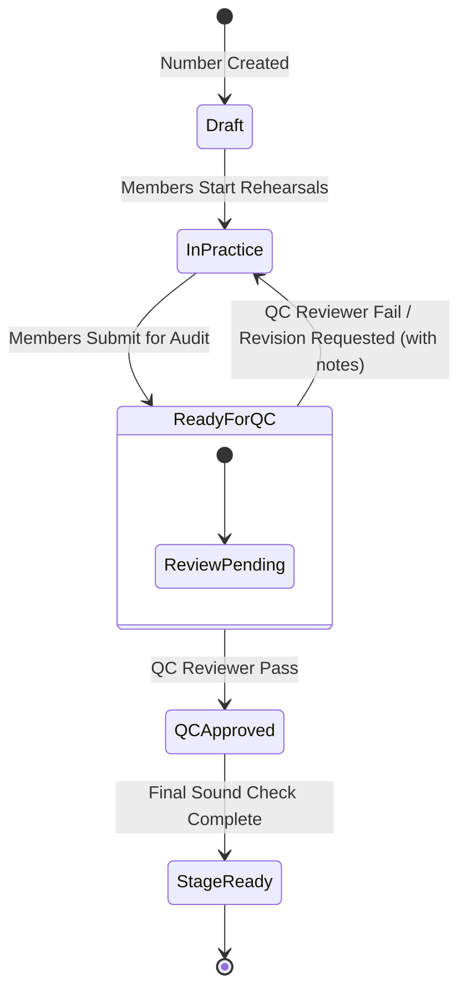

# Technical Design Specification: Show Management & Resource Allocation Features

**Project**: CSAC Timetable Studio 🎵📅  
**Document Status**: Approved Design Spec / SSOT  
**Date**: September 2026  
**Author**: PO, System Architect, UI Designer & Dev Team  

---

## 1. Executive Summary & Core Objectives

This specification details the deep features and UX architecture for managing **Music Shows** across `/admin/shows` and `/studio/shows/[id]/*`. 

### Key Goals
1. **Strict Governance QC FSM**: Implement a 5-stage Finite State Machine for Music Numbers (`Draft` $\rightarrow$ `In Practice` $\rightarrow$ `Ready for QC` $\rightarrow$ `QC Approved` $\rightarrow$ `Stage Ready`). Enforce role-restricted transitions where only assigned Admins/Moderators/QC Reviewers can approve or fail a number (returning `Ready for QC` back to `In Practice` with mandatory feedback notes).
2. **Member Resource Allocation (RA) & Fatigue Analytics**: Track member involvement across music numbers, displaying soft workload warning indicators (`Optimal`, `Moderate`, `Fatigued`) based on active song counts and rehearsal hours.
3. **Decoupled Bento-Grid Hub**: Seamlessly integrate `/admin/shows` (executive management & capacity creation) with `/studio/shows/[id]/*` (operational show deep workspaces).
4. **Localization (i18n)**: Fully support bilingual strings (English `en` & Vietnamese `vi`) across all new show management UI surfaces.

---

## 2. Technical Data Contracts & Schemas

### 2.1 Types (`clients/web/src/lib/types/timetable.ts`)

```typescript
export type MusicNumberStatus = 
  | 'draft' 
  | 'in_practice' 
  | 'ready_for_qc' 
  | 'qc_approved' 
  | 'stage_ready';

export type BandRole = 
  | 'vocal_lead' 
  | 'vocal_harmony' 
  | 'guitar_lead' 
  | 'guitar_rhythm' 
  | 'bass' 
  | 'keys' 
  | 'drums' 
  | 'percussion' 
  | 'sound_tech';

export interface QCVerdict {
  reviewedBy: string;
  reviewedAt: string;
  decision: 'passed' | 'revision_requested';
  feedbackNotes: string;
  actionItems?: string[];
}

export interface RosterMember {
  userId: string;
  fullName: string;
  email: string;
  primaryRole: BandRole;
  assignedNumberIds: string[];
  totalPracticeHours: number;
  workloadStatus: 'optimal' | 'moderate' | 'fatigued'; // Green (1-2), Yellow (3-4), Red (5+)
}

export interface MusicNumber {
  id: string;
  showId: string;
  title: string;
  originalArtist: string;
  status: MusicNumberStatus;
  rolesRequired: BandRole[];
  assignedMembers: Record<string, string>; // BandRole -> userId
  qcHistory: QCVerdict[];
  notes?: string;
}
```

---

## 3. Workflow & FSM Rules

### 3.1 Music Number FSM Transitions



* **Member Authority**: Members assigned to a song can transition `Draft` $\rightarrow$ `In Practice` $\rightarrow$ `Ready for QC`.
* **QC Authority**: Only active Admins or Moderators assigned as QC Reviewers can transition `Ready for QC` $\rightarrow$ `QC Approved` or return `Ready for QC` $\rightarrow$ `In Practice` with a mandatory `QCVerdict`.

---

## 4. UI/UX Layout Specifications

### 4.1 Admin Shows Overview (`/admin/shows`)
* **Create Show Modal**: Input fields for Title, Description, Venue, Date Range, Target Numbers Count.
* **Monitor Metrics Cards**: Total Music Numbers, Total Practice Hours, Average QC Pass Rate %, Active Practice Sprints.
* **Show Directory Cards**: Direct action button to open `/studio/shows/[id]/overview`.

### 4.2 Music Numbers Kanban (`/studio/shows/[id]/numbers`)
* 5 Kanban Columns corresponding to the FSM statuses.
* Song Card badges displaying title, artist, assigned role tags, and QC verdict indicators.
* **QC Verdict Drawer**: Slide-over drawer when reviewing a song in `Ready for QC`, allowing QC Reviewer to enter feedback and select `Pass` or `Request Revision`.

### 4.3 Show Roster & Resource Allocation (`/studio/shows/[id]/roster`)
* Roster table with member avatars, primary roles, assigned song badges, and workload health pills (`Optimal` green, `Moderate` yellow, `Fatigued` red).
* Role coverage check: Highlights unfilled roles across all active show numbers.

---

## 5. Verification & Test Plan

1. **Automated Test Suite (`clients/web/test_suite.ts`)**:
   - `verifyMusicNumberFSM()`: Tests valid FSM transitions and blocks invalid transitions without QC authority.
   - `verifyResourceAllocationWorkload()`: Asserts correct calculation of `workloadStatus` given assigned number counts.
2. **Build Verification**:
   - `pnpm run test` must execute 100% cleanly with zero assertion errors.
   - `pnpm run build` must produce a clean SvelteKit production build without TypeScript or SSR errors.
