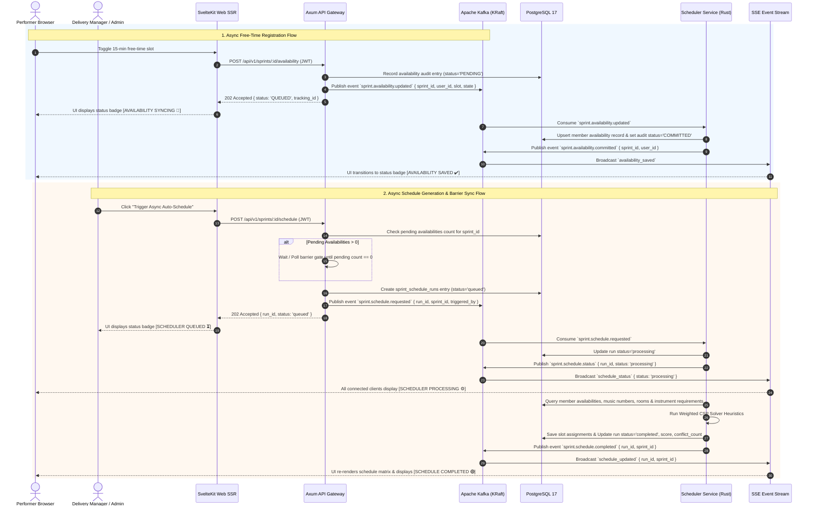

# Specification: Async Sprint Planning, CSP Solver Algorithm, Kafka Pipeline & SSE Task Signals

**Date**: September 12, 2026  
**Status**: Approved for Implementation Plan  
**Authors**: CSAC Dev Team (Product Owner, Software Architect, Honest Developer, Strict QC, Requirements User)  

---

## 1. Executive Summary & Business Intent

This document specifies the technical design for the **Async Sprint Planning & Real-Time Schedule Generation System** for CSAC Timetable Studio. 

### Core Requirements
1. **Async Free-Time Registration**: Performer availability slot toggles are processed asynchronously via Apache Kafka (`sprint-availabilities` topic), providing immediate non-blocking UI interactions with visual sync status indicators.
2. **Barrier-Synchronized Scheduler Trigger**: Schedule computation requests wait until all prior enqueued availability registration events for the target sprint are fully processed before starting the solver algorithm.
3. **Rust CSP Scheduler Algorithm**: A weighted Constraint Satisfaction Problem (CSP) solver utilizing Arc Consistency (AC-3) and Min-Conflicts local search optimization running in the Rust `scheduler-service`.
4. **SSE Real-Time Push & Task Status Signals**: Live push updates over Server-Sent Events (`/api/v1/sprints/:id/schedule/stream`), driving dynamic Svelte 5 visual signal badges (`[QUEUED ⏳]`, `[PROCESSING ⚙️]`, `[COMPLETED 🟢]`, `[FAILED 🔴]`) and automatic calendar grid re-renders.
5. **Production Seeding**: Comprehensive SQL & Rust database seeding script targeting PostgreSQL 17 to populate realistic CSAC music show performers, instruments, practice rooms, music numbers, and sprint time slots.

---

## 2. System Architecture & Event Pipeline



---

## 3. Scheduler Algorithm: Weighted CSP Solver Specs

### 3.1 Hard Constraints (Must Satisfy Score = $\infty$ Penalty)
1. **Performer No Double-Booking**: A member $M$ cannot be assigned to more than 1 practice room in the same 15-minute time slot $T$.
2. **Room Capacity & Instrument Fit**: Room $R$ capacity must $\ge$ number of assigned performers, and required room instruments must be available.
3. **Performer Free-Time Match**: A practice slot can only be scheduled at time $T$ if ALL assigned performers for that music number task are marked available at time $T$.
4. **Task Duration & Continuity**: A practice task needing $K$ contiguous slots (e.g. 4 slots = 1 hour) must be scheduled in $K$ consecutive slots without interruption.

### 3.2 Soft Constraints (Weighted Optimization Score)
1. **Performer Preferred Time Slots** (Weight +10 per performer preference match).
2. **Minimized Practice Gap Penalty** (Weight -15 per idle 15-min gap between practices for a member on the same day).
3. **Balanced Practice Load** (Weight -5 per standard deviation in total practice hours across members).
4. **Room Utilization** (Weight +5 per compact room schedule block).

### 3.3 Algorithm Workflow (Rust `scheduler-service`)
```
Inputs: Sprint ID, Time Slots S, Performers P, Music Numbers N, Rooms R
1. Build Constraint Graph: Variables = Tasks T_i, Domains = { (Room, Slot_Start) }
2. Perform Constraint Propagation (AC-3) to prune illegal domains (e.g., unavailable performers).
3. If any domain becomes empty, trigger backtracking fallback with partial conflict relaxation.
4. Execute Min-Conflicts Local Search (Max Iterations = 10,000, Timeout = 5000ms):
   - Evaluate total penalty function: Cost(State) = Sum(Soft Constraint Penalties)
   - Iteratively swap variables to minimize Cost(State).
5. Output: Optimal Schedule Matrix & Run Statistics (score, conflict_count, duration_ms).
```

---

## 4. API Endpoints & SSE Schema

### 4.1 Axum Gateway Endpoints
* `POST /api/v1/sprints/:id/availability`
  - **Body**: `{ slot_label: string, day_of_week: string, is_available: boolean }`
  - **Response (202 Accepted)**: `{ status: "queued", tracking_id: string }`
* `POST /api/v1/sprints/:id/schedule`
  - **Header**: `Authorization: Bearer <JWT>` (DM/Admin/Moderator role required)
  - **Response (202 Accepted)**: `{ run_id: string, status: "queued" }`
* `GET /api/v1/sprints/:id/schedule/stream`
  - **Type**: `text/event-stream`
  - **Events**:
    - `event: availability_saved` $\to$ `{ user_id, sprint_id }`
    - `event: schedule_status` $\to$ `{ run_id, sprint_id, status: "processing" | "queued" | "failed" }`
    - `event: schedule_updated` $\to$ `{ run_id, sprint_id, status: "completed", score: number, conflict_count: number }`

---

## 5. UI Task Status Signals & Svelte 5 Implementation

### 5.1 Dynamic Status Indicator Component (`TaskStatusSignal.svelte`)

| State | Visual Indicator | CSS Theme | Description |
| :--- | :--- | :--- | :--- |
| `IDLE` | `[ READY 🟢 ]` | Slate / Emerald accent | System idle & idle state. |
| `SYNCING` | `[ SYNCING 🔄 ]` | Amber pulse | Transmitting availability update over Kafka. |
| `SAVED` | `[ SAVED ✔️ ]` | Emerald badge | Availability confirmed by DB consumer. |
| `QUEUED` | `[ SCHEDULER QUEUED ⏳ ]` | Cyan pulse | Schedule compute job waiting in Kafka queue. |
| `PROCESSING` | `[ COMPUTING SCHEDULE ⚙️ ]` | Purple shimmer | CSP solver running in Rust `scheduler-service`. |
| `COMPLETED` | `[ SCHEDULE READY 🟢 ]` | Vivid Orange / Green | Schedule updated live in matrix calendar. |
| `FAILED` | `[ COMPUTATION FAILED 🔴 ]` | Rose / Red alert | Solver error or unsatisfiable hard constraints. |

---

## 6. Real Production Data Seeding Plan

The seed script will populate PostgreSQL 17 with realistic CSAC show data:

1. **Show**: `CSAC Autumn Live Showcase 2026`
2. **Performers (8 Users)**:
   - Alice (Lead Vocals & Rhythm Guitar) - Role: PM
   - Bob (Drums & Percussion) - Role: Member
   - Charlie (Bass Guitar) - Role: QC
   - Diana (Keyboards & Synth) - Role: Member
   - Eve (Lead Guitar) - Role: Member
   - Frank (Backing Vocals & Acoustic Guitar) - Role: Member
   - Grace (Delivery Manager) - Role: DM
   - Admin User - Role: Admin
3. **Rooms (3 Studios)**:
   - Studio A (Large Band Room, Full Drumkit, 2 Amps, Digital Piano)
   - Studio B (Acoustic & Vocal Studio, Piano, Microphones)
   - Studio C (Rehearsal Room, Amps, Synth Rig)
4. **Music Numbers (4 Track Numbers)**:
   - Number 1: "Bohemian Rhapsody Cover" (Complex, 5 Performers, 2 Hours Practice)
   - Number 2: "Hotel California Acoustic" (3 Performers, 1.5 Hours Practice)
   - Number 3: "Uptown Funk" (4 Performers, 1 Hour Practice)
   - Number 4: "Autumn Leaves Jazz Stand" (3 Performers, 1 Hour Practice)
5. **Sprint**: `Sprint 1 - Initial Rehearsal Week` (7 Days, 15-minute grid slots from 08:00 to 22:00).

---

## 7. Verification & Testing Strategy

1. **Unit & Integration Tests**:
   - `pnpm run test` in `clients/web`: Test Svelte 5 SSE state store & RBAC action stripping.
   - `cargo test` in `servers/services/scheduler-service`: Verify CSP Solver hard constraint satisfaction & Min-Conflicts convergence.
2. **System & Container Verification**:
   - `pnpm run build`: Validate web client production compilation.
   - `docker ps` / `podman compose`: Confirm gateway, scheduler-service, postgres, kafka, and sse streaming are operating cleanly.
