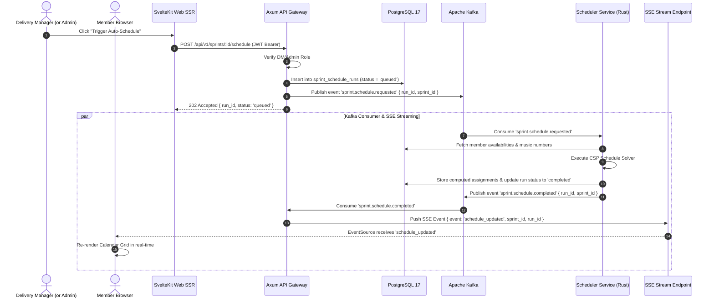

# Specification: RBAC UX Redesign, SSR Action Security & Async CSP Scheduler

**Date**: September 12, 2026  
**Status**: Approved / Ready for Implementation  
**Authors**: Antigravity AI & CSAC Team  

---

## 1. Overview & Business Objectives

This specification details the architectural redesign of user authorization, UI role scoping, and practice sprint timetable computation for CSAC Timetable Studio.

### Objectives
1. **Strict Role-Based UI Scoping (RBAC)**: Ensure members only see UI surfaces aligned with their role level (Member, QC, PM, DM, Moderator, Admin).
2. **SSR Action Security (Zero Probing)**: Action buttons (e.g. creating/deleting music numbers, registering gear, invoking scheduler, modifying user roles) are stripped at Server-Side Rendering (SSR) time, ensuring non-privileged roles receive rendered HTML free of administrative action controls or API handlers.
3. **Async CSP Scheduler via Apache Kafka**: Move CPU-bound practice sprint schedule computation out of synchronous HTTP request handlers and into an asynchronous queue processed by the Rust `scheduler-service`.
4. **Real-Time Synchronized Schedule Updates via SSE**: Push job state (`QUEUED`, `PROCESSING`, `COMPLETED`, `FAILED`) and live schedule changes to all connected client browsers over Server-Sent Events (SSE).
5. **Registration & Compute Audit History**: Track and expose audit logs for user free-time registration history (ADD, UPDATE, DELETE) and schedule compute run history (timestamps, score, conflict metrics, trigger actor).

---

## 2. Role Hierarchy & Superset Matrix

The system organizes access across 6 distinct role levels, built as strict supersets:

```
[ Member ] ──> [ QC Reviewer ] ──> [ Performance Manager (PM) ] ──> [ Delivery Manager (DM) ] ──> [ Moderator ] ──> [ Admin ]
```

| Role | Scope & Permissions | Visible Pages & Tabs | Action Capabilities | SSR Action Stripping |
| :--- | :--- | :--- | :--- | :--- |
| **Member** | Performer baseline | `/studio/shows/[id]/overview`, `/studio/shows/[id]/numbers`, `/studio/shows/[id]/sprints`, `/studio/gear` | Register personal 15-minute sprint free-time grid; view show schedule calendar & numbers. | **Stripped**: All create/edit/delete buttons for numbers, instruments, tasks, and admin links. |
| **QC (Quality Checker)** | Reviewer baseline (Superset of Member) | Member views + QC Audit Workstation tab | Submit QC task verdicts (`passed`, `in_progress`, `blocked`) and review feedback for assigned tasks. | **Stripped**: Number creation, performer assignments, scheduler trigger, user administration. |
| **PM (Performance Manager)** | Music Number Leader (Superset of QC) | QC/Member views + PM Management Panel for assigned numbers | Assign performers & instruments to managed numbers; create Study/Create tasks; view free-time & compute history. | **Stripped**: Show-wide scheduler trigger, admin pages (`/admin/*`). |
| **DM (Delivery Manager)** | Event Lineup Director (Superset of PM) | PM views + Show-wide controls & Scheduler Trigger | **Trigger Sprint Scheduler**; manage all show numbers; manage instrument allocation heatmap; inspect full audit history. | **Stripped**: User onboarding & role demotion (`/admin/users`, `/admin/approve`). |
| **Moderator** | Event Operations (Superset of DM) | DM views + `/admin/events` | Create & close voting events; configure time slots; trigger sprint scheduler. | **Stripped**: User demotion quorum approval (`/admin/approve`). |
| **Admin** | Full Governance (Superset of Moderator) | **100% Full System Access** (`/admin/users`, `/admin/approve`, `/admin/events`, `/studio/*`) | Full administrative capabilities: user onboarding, role demotion proposals, OTP quorum voting, event lifecycle, scheduler execution. | **None**: Full action controls rendered. |

---

## 3. Technical Architecture & Component Design

### 3.1 SSR Security & Action Stripping (`clients/web`)
* **Session & Claims Injection (`hooks.server.ts`)**: Decodes JWT from HTTP HttpOnly cookie `csac_session` or `Authorization` header, populating `event.locals.user` with `{ id, email, full_name, role }`.
* **Page Server Loaders (`+page.server.ts`)**: Serves role metadata to Svelte 5 components.
* **Component-Level Conditional Rendering**:
  ```svelte
  {#if data.user && hasRole(data.user.role, 'dm')}
    <button class="btn-primary" onclick={triggerScheduler}>Auto-Schedule Sprint</button>
  {/if}
  ```
* Non-privileged roles never receive the DOM elements or event handlers in the rendered HTML output.

### 3.2 Asynchronous Schedule Compute & Real-Time Sync Pipeline



### 3.3 Database Schema Extensions (PostgreSQL 17)

```sql
-- 1. Free-Time Registration Audit Log
CREATE TABLE member_sprint_availabilities_history (
    id UUID PRIMARY KEY DEFAULT gen_random_uuid(),
    sprint_id UUID NOT NULL REFERENCES practice_sprints(id) ON DELETE CASCADE,
    user_id UUID NOT NULL REFERENCES users(id) ON DELETE CASCADE,
    actor_id UUID NOT NULL REFERENCES users(id) ON DELETE CASCADE,
    action VARCHAR(20) NOT NULL, -- 'ADD', 'UPDATE', 'DELETE'
    slot_label VARCHAR(100) NOT NULL,
    day_of_week VARCHAR(50) NOT NULL,
    is_available BOOLEAN NOT NULL,
    created_at TIMESTAMPTZ NOT NULL DEFAULT NOW()
);

-- 2. Schedule Compute Runs & History
CREATE TABLE sprint_schedule_runs (
    id UUID PRIMARY KEY DEFAULT gen_random_uuid(),
    sprint_id UUID NOT NULL REFERENCES practice_sprints(id) ON DELETE CASCADE,
    triggered_by UUID NOT NULL REFERENCES users(id) ON DELETE CASCADE,
    status VARCHAR(50) NOT NULL DEFAULT 'queued', -- 'queued', 'processing', 'completed', 'failed'
    duration_ms INT,
    score DOUBLE PRECISION,
    conflict_count INT DEFAULT 0,
    assignments JSONB,
    error_message TEXT,
    created_at TIMESTAMPTZ NOT NULL DEFAULT NOW(),
    completed_at TIMESTAMPTZ
);
```

### 3.4 API Endpoints
* `POST /api/v1/sprints/:id/schedule`: Triggers async CSP schedule job (DM / Admin / Moderator). Returns `202 Accepted` with `{ run_id, status }`.
* `GET /api/v1/sprints/:id/schedule/stream`: Server-Sent Events (SSE) endpoint streaming real-time status and schedule updates.
* `GET /api/v1/sprints/:id/schedule/history`: Returns compute run history for PM/DM/Admin.
* `GET /api/v1/sprints/:id/availability/history`: Returns member availability registration history for PM/DM/Admin.

---

## 4. Verification Plan

1. **Automated Tests**:
   - `pnpm run test`: Ensure all test assertions pass (including role hierarchy checks & translation parity).
   - `pnpm run build`: Verify clean SvelteKit production build without TypeScript errors.
2. **Manual Verification**:
   - Inspect member view vs DM/Admin view to verify action buttons are absent in initial SSR HTML.
   - Trigger async schedule calculation and observe SSE real-time update.
